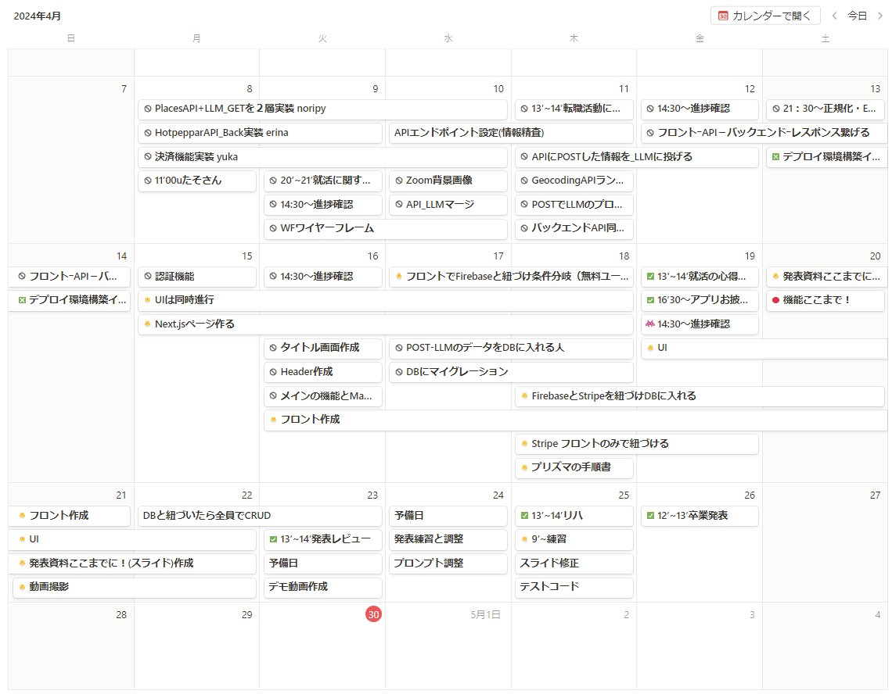

# Project Name: -Bu.Ra.Ri-さんぽっと- <br>
teamblastPJ

## 概要
普段忙しいけど外出したい人向けに、自宅近くのおすすめの駅とその駅から徒歩で行ける周辺情報の提案をしてくれるアプリを作成しています。
## 目的
* 時間効率の最大化（短時間での外出計画の提案・補助）
* エンタメ性（今まで知らなかった場所や体験ができる）
* アクセシビリティの向上（最寄りの駅を入力し、ボタンを押すだけなので誰でも気軽に使えます）
* 地域経済の活性化（地元の観光地や施設を推薦し経済に貢献）
* パーソナライズされた提案
（一人・子連れ・カップル / のんびり・アクティブ・短時間<br>
等を選択することで個別性を高める工夫を行った。）
## 作成理由
* 子供がいて土日は一緒に出かけたいけれど、出かける場所もワンパターンになってきた。平日忙しく調べる時間がない。
## 使い方
* 以下をクローンして使用します。
 ```java:title
git clone https://github.com/ms-engineer-bc7/teamb-lastPJ.git
```
* Docker環境推奨
1. ブラウザなどに表示させます
2. 現在地や最寄り駅を入力し送信します
3. ランダムに近くのおすすめの駅がセットされます
4. 誰と行くか・どんな時間を過ごしたいかを選びます
5. レコメンドボタンを押します
6. おすすめ駅から徒歩で行ける範囲の施設や飲食店などの提案が返ってきます
7. 楽しい時間をお過ごしください

## 開発
* アジャイル

## 技術選定と選定理由
### フロントエンド：<br>
 Next.js app router（授業で使用し短期の開発に置いて学習コストが低い。）<br>
 Typescript(型安全性が高まり、保守性が向上できる。)<br>
### バックエンド：
FastAPI （スタートアップが速く、少ないコードでWebAPIを構築できる。非同期処理に対応している。）<br>
Python（初学者にとって扱いやすい言語である。）<br>
### データベース：
PostgreSQL（オープンソースで無料で利用可能）<br>
### 決済機能：
Stripe（決済機能の実装が比較的簡単で、ドキュメントが充実している。）<br>
### 認証認可機能：
Firebase （認証機能の実装が容易）<br>
### API <br>
GoogleMapsAPI：（GeocodingAPI・PlacesAPI・Directions API）<br>
HotpepparAPI<br>
地図やグルメ情報を扱う実践的な課題として適している
APIの利用方法を学べる

### LLM：OpenAI-ChatGPT+Langchian
ChatGPTの対話機能で、自然言語処理の理解が深まる
LangchainでChatGPTを実践的に活用できる
## 

 

## 制作者
* NORIKO ISHIDO
* ERINA HASEGAWA
* YUKA ITO

## 書類はこちら
[プロダクト要求仕様書（PRD）](https://miniature-icon-2d2.notion.site/PRD-2e8ad23d47c549c18a75c2405120c631?pvs=4)<br>
[画面仕様書](https://www.notion.so/WF-5e7afd39bdbd45c7bd14eb6c8ba06b7f)<br>

## タスク管理
[Team Bu.Ra.Ri◎タスク管理](https://miniature-icon-2d2.notion.site/Team-Bu-Ra-Ri-aeb75cd0b56548659f275092f95e250f?pvs=4)<br>

## スケシュール
